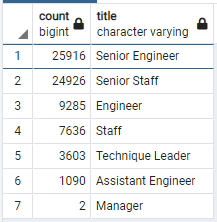
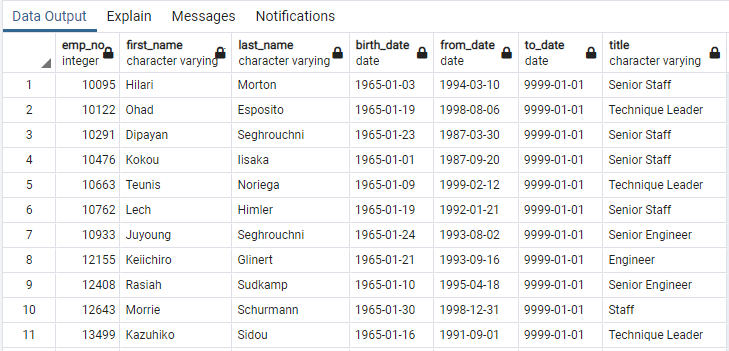
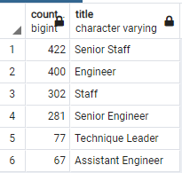
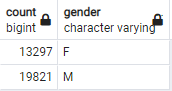

# Pewlett-Hackard-Analysis
## Overview of the "Silver Tsunami" Analysis
The purpose of this analysis is to determine how many employees, by title, may potentially be retiring soon. Also, identify how many employees would be eligible to participate in a potential mentorship program to prefill the retirement slots created by the retiring employees. 

## Results
The database provided was queried to retrieve the potential retirees grouped by title as well as to develop a list of potential candidates for a proposed mentorship program. The results of that query are shown below.

Based on the data outputs shown above, the following points can be noted.

-As can clearly be seen in the charts above, the bulk of the potential retirements are in the Senior positions of Engineering and Staff which makes sense as these positions tend to require many years of experience within the company.

-Given the considerably lower numbers approaching retirement in the lower-level positions, it appears there is an unbalanced distribution of ages within the company.

-There are 1,549 employees eligible for the proposed mentorship program. This is clearly not a large enough pool to fully offset the estimated retirees.

-It also can be seen by just the few titles shown in the sample for the mentorship program, there is a portion of these candidates that are already in the senior level positions.

## Summary

To summarize, the potentialretirees are concentrated mostly int he senior positions. Also, the potential pool to pull from for a mentorship program is not adequate to backfill the retirees' positions.

In order gain more insight into the situation two more queries were developed. The first was to show the distribution of employees amongst the candidates for mentorship. The table below clearly indicate that, amongst the candidates, almost half are already in the Senior level position. Using these employees to backfill retirees' positions creates yet another vacancy at that level of management.

Furthermore, since a plan clearly must be developed to address the upcoming retirements, it makes sense to look at the diversity of the workforce to make sure the workforce is balanced with respect to gender in order to have the best chance of leveraging the benefits of a diverse workforce. A query was developed to pull from the current employees data table while joining it with the employees table to find the number of male and female employees. As can be seen by the table below, a plan to correct the imbalance may be needed and now is the time as it would dovetail with the recruitment efforts needed to backfill the retirees positions. 

